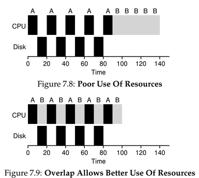

# Scheduling

High-level policies that an OS scheduler employs - it's often called disciplines.

## Workload Assumptions

Workload is the name given to the processes running in the systems.

Processes are often called jobs.

In our scenario:

1 - Each job runs for the same amount of time;

2 - All jobs arrive at the same time;

3 - Once started, each job runs to completion;

4 - All jobs only use the CPU;

5 - The run-time of each job is known.

👆 Unrealistic Scenario.

## Scheduling Metrics

### Turnaround time

The turnarund time of a job is defined as the time at which the job comletes minus the time at which the job arrived in the system:

```shell
Tturnaround = Tcompletion - Tarrival
```

It is a **performance metric**.

*Fairness* is also an important metric, but it often at odds in scheduling; a scheduling may optimze performance but at the cost of preventing a few jobs to run, reducing fairness.

## FIFO - First In, First Out

Also called First Come, First Served (FCFS).

**Convoy Effect**: A number of relatively short potential consumers of a resource gets queued behind a heavyweight resource consumer.

## Shortest Job First (SJF)

Self-explanatory.

Still suffers from the *convoy problem*. It happens if the biggest process arrives before the other ones - if it is a nonpreemptive scheduler.

## Preemptive Schedulers

A program doesn't need to run to completion before stopping. They can stop one process from runnning in order to run another.

**Context Switch**: Stopping one process temporarily and resuming - or starting another.

## Shortest Time-to-Completion First (STCF)

Keep in a mind, the scheduler can preempt a job - it does not have to run until completion.

It **adds preemption to SJF** so it fix some issues the previous algorithm have.

Anytime a new job enters the system, the scheduler determines which of the remaining jobs have the least time left and schedules that one.

> It results in a much-improved turnaround time.

It used to be optimal - not in time-shared machines.

## Response Time - New Metric

It is the time the jobs enters in the system to the time it is scheduled first.

```sh
Tresponse_time = Tfisrt_run - Tarrival
```

STCF is not great for the response time metric --> Three jobs kicks in at the same time. The last one must wait for the other two finish to start its execution.

## Round Robin (RR)

New scheduling algorithms that solves the STCF algorithm response-time related issues.

Instead of running jobs to completion, it runs them for a **specific time slice (scheduling quantum)** and then switches to the next job in the **⚠️ cyclical queue ⚠️**.

The length of a time-slice must be multiple of the timer-interrupt period.

    Amortization:

    It is commonly used in system where there is a fixed cost to some operation. By incurring that cost less often, the total cost to the system is reduced --> Perfoming the operation less times - less context switches.

> The length of the time slice is critical for RR. The shorter it is, the better the performance under the response-time metric.

Time-slice being short has its downside: **The cost of context-switch is ver high**, it will dominate overall performance.

RR is one of the ***worst policies** for the turnaround metric*.

Pretty much any *fair policy* will struggle under the turnaround metric. If you are willing to be unfair, you can run shorter jobs to comletion at the cost of response time.

Trade-offs are common in systems, you must think about what to **prioritize**.

    Overlap:

    When possible, overlap operations to maximize the utilization of the system.

    Perfoming disk I/Os or sending messages to remote machines.


**EXAMPLE**: Two jobs are running using STCF. A has 5 subprocesses of 10ms each, B has a 50ms job. The most common approach is treating each subprocess of A as an independent job. So when the subprocess completes B is left and it begins running, then a new subprocess of A is submitted and it starts running (STCF) and it happens until it all finishes -> Overlap and I/O approach. Read below.



The are two types of schedulers:

| SJF / STCF | RR |
| :---: | :---: |
|Turnaround Time | Response Time |

## Incoporating I/O

The process is **blocked** waiting for the I/O to complete. The scheduler should probably schedule another process in the meantime.

The CPU treats I/O as independent processes, even though they are subprocesses of the same process. It allows overlap to happen.

💡 Keep in mind that the system doesn't know for how long a process is going to run. It is a scheduler known as **multi-level feedback queue** which uses the *recent past to predict the future*.

## Questions

1. Compute the response time and turnaround time when running three jobs of length 200 with the SJF and FIFO schedulers.

    Important things to notice: Only CPU, nonpreemptives and no I/O.

    Response Time and FIFO: Job A response time is going to be 0; B is 200; and C is 400. Average time = (0 + 200 + 400) / 3 = 200ms

    Response Time and SJF: Same as FIFO, since they are the same length. Average time = (0 + 200 + 400) / 3 = 200ms

    Turaround and FIFO: Job A completes in 200ms; B in 400ms; and C in 600ms. Average time = (200 + 400 + 600) / 3 = 400ms

    Turnaround and SJF: Same as FIFO. Average time = (200 + 400 + 600) / 3 = 400ms